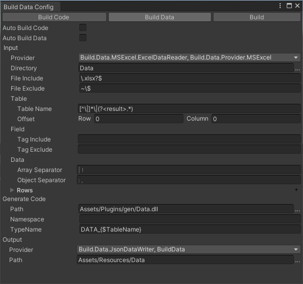

# 生成数据工具

导表工具，Excel 导出为 Json


## 配置界面




## 菜单

菜单路径 Build/Data

- **Build**

  生成代码和数据

- **Settings**

  打开配置编辑器
  
- **Build Data**

  生成数据

- **Build Code**

  生成代码


## 使用

1. ### 编辑配置

   点击菜单 `Build/Data/Settings` 生成 `ProjectSettings/Data.json` 配置文件

   - 配置的路径都是相对于该配置文件目录位置

   

2. ### 初始化代码

	```c#
[OnInitialize(InitializeType.Data)]
static void ConfigurationData()
{
   	string DataClassNamePrefix = "DATA_";

    	DataUtility.InitializeJsonData(typeof(DATA_Config).Assembly, (className) =>
		{
            string assetName = className;
            if (DataClassNamePrefix.Length > 0)
                assetName = assetName.Substring(DataClassNamePrefix.Length);
            var text = AssetBundles.LoadAsset<TextAsset>("data", assetName);
            if (!text)
                throw new Exception("data not exists, assetName: " + assetName);

            byte[] data = text.bytes;
            return data;
        });
	
	    //测试输出数据数量
		//Debug.Log("Config Data count:"+ DATA_ConfigIndexer.Instance.list.Count);
	}
	```
	
	- DATA_
	
	   生成类的前缀
	
	- typeof(DATA_Config).Assembly
	
	  生成类的程序集
	
	


## 表结构

| 1    | 序号          | 姓名   | 数组   | 注释     |
| ---- | ------------- | ------ | ------ | -------- |
| 2    | ID            | Name   | _Array | Comment  |
| 3    | int           | string | int[]  | string   |
| 4    | key           |        |        |          |
| 5    | client/server | client | client | exclude  |
| 6    | 1             | Test   | 1,2,3  | 张三用户 |

行说明

1. **FieldDescription**

   可选，字段描述

2. **FieldName**

   字段名称

3. **FieldType**

   字段类型

4. **Keyword**

   可选，字段定义，包含（key，enum，struct 等）

6. **~~Exclude~~**

   可选，排除列，正则表达式格式

7. **Data**

   可选，数据开始行，如果未设置则默认最大索引的下一行


### 枚举

| Name     | Value |
| -------- | ----- |
| string   | int   |
| **enum** |       |
| Enum1    | 1     |
| Enum2    | 2     |

- Name

  保留名称，枚举名称

- Value

  保留名称，枚举值

- enum

  枚举定义关键字


### 结构体

| Field1     | Field2 |
| ---------- | ------ |
| int        | string |
| **struct** |        |


## 关键字

**Keyword**，字段定义选项

语法

```
keyword[ keyword]...
```

带参数格式 

```
keyword([parameter])
```


- key

  设置主键，生成 `{TableName}_Indexer` 类

- class

  定义类型为类，默认为类，

- enum

  定义类型为枚举，必须包含`Name`枚举名称和`Value`枚举值两个字段，枚举值在生成的代码中，所以不会导出数据


- struct

  定义类型为结构体
  
- default(value)

  设置字段默认值，当表格值为 `null` 或 `empty` 时使用默认值

- nodata

  不导出该表数据，一般用作类型定义，如: 嵌套类型

- index(number)

  显式设置字段顺序

  - number

    索引值从0开始

- arr_sep(separator)

  定制该列数组分隔符

  - separator

    默认：`| !`, 多级使用空格分隔

- obj_sep(separator)

  定制该列结构体分隔符

  - separator

    默认：`: ,`, 多级使用空格分隔

- client

  设置 `client` 标签

- server

  设置 `server` 标签

- exclude

  排除该列，不生成字段

- tag(tagName)

  设置字段标签，可用于字段过滤配置项 `TagInclude` ， `TagExclude`

  - tagName

    标签名称

- ~~conv(IConverter)~~

  定制数据转换器
  
  - IConverter
  
    数据转换器名称
  
- ~~fk(foreignKey)~~

  数据类型为结构体，数据值为外键表 Key 值，转换为外键表结构体

  - foreignKey

    外键表主键名称
  
- ~~fk_rule(rule)~~

  外键生成规则，数据类型为结构体，数据值保持为空，会忽略该列值，转换时根据规则来生成主键值, 再转换为外键表结构体
  
  - rule
  
    规则值来自于当前表
  
    样例
    
    ```c#
  {$ID}
    ```
    
    ```
  {$ID}_{$Name}
    ```
    
    


  


## 命令行

#### 命令行参数

- -data

  导出数据

- -code

  导出代码

- -config=< config file path >

  配置文件路径，绝对路径或者相对路径

  相对路径为相对于 BuildData.exe 路径
  
  
  
  


#### 导出数据

1. 新建空的批处理文件 `BuildData.bat`

2. 添加以下内容
	 	```bat
   cd <Project Directory>
   "Packages/Unity.Build.Data/Editor/BuildData.exe" -code -data -config="ProjectSettings/Data.json"
   pause
   ```


## 开启自动生成

1. 打开设置面板
   - 勾选 `自动生成代码`
     源文件内容发生修改后自动执行生成代码
   - 勾选 `自动生成数据`
   源文件内容发生修改后自动执行生成数据


## 数据类型

- ###### int8

  8位有符号整形

- ###### int16

  16位有符号整形

- ###### int32, int

  32位有符号整形

- ###### int64, long

  64位有符号整形

- ###### uint8, byte

  8位无符号整形

- ###### uint16

  16位无符号整形

- ###### uint32, uint

  32位无符号整形

- ###### uint64, ulong

  64位无符号整形

- ###### float32, float

  32位浮点数

- ###### float64, double

  64位浮点数

- ###### bool, boolean

  布尔值, 值: true, false, 0, 1

- ###### string

  字符串类型

- ###### []

  数组类型, 如: int[], string[]
  
  数据分割符, 默认：`| `

- ###### Eunm

  数据表为枚举类型

- ###### {Table Name}

  数据表类型
  
  数据分隔符：`Object Separator` 默认：`:`


## 扩展

### 扩展输入

1. 继承输入数据 `DataReader`
2. 设置输出 `dll` 名称格式 `Build.Data.Provider.xxx.dll`
3. 将 `dll` 放在 BuildData.exe 所在目录下
4. 打开设置面板，`输入/提供程序`下拉列表会显示新增的提供程序


### 扩展输出

1. 继承输出数据 `DataWriter`
2. 设置输出 `dll` 名称格式 `Build.Data.Provider.xxx.dll`
3. 将 `dll` 放在 BuildData.exe 所在目录下
4. 打开设置面板，`输出/提供程序` 下拉列表会显示新增的提供程序


### ~~数据转换器~~

1. 继承 `IConverter` 基类
2. 设置 `dll` 名称格式 `Build.Data.Provider.xxx.dll`
3. 运行时加载当前目录所有带名称带 `DataConverter` 的 `dll`

