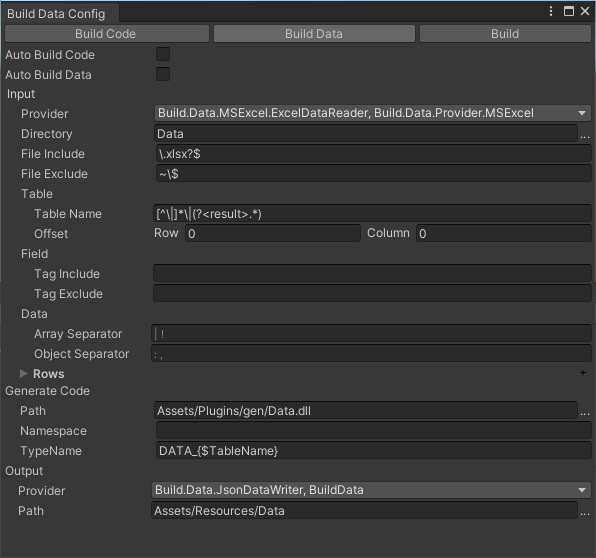
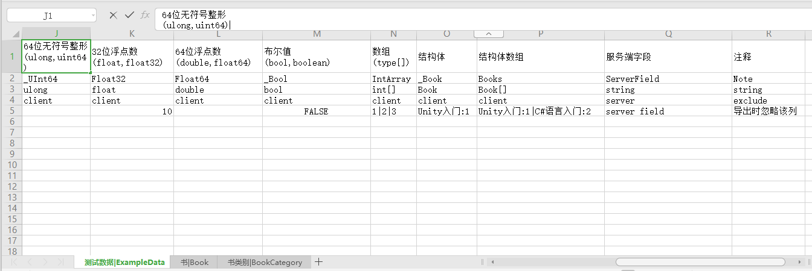

# Unity.Build.Data

Unity Package


## 配置界面






## manifest.json

```
"unity.guiextensions": "https://github.com/liuwenjiexx/Unity.GuiExtensions.git",
"unity.localization": "https://github.com/liuwenjiexx/Unity.Localization.git?path=/Assets/Plugins/Unity.Localization",
"unity.build.data": "https://github.com/liuwenjiexx/Unity.Build.Data.git?path=/Assets/Plugins/Unity.Build.Data"
```


## 快速使用

1. 点击菜单 `Build/Data/Settings` 打开设置窗口

   首次打开将生成配置文件 (`ProjectSettings/Packages/unity.build.data/Settings.json`)

2. `Project/Data`文件夹，包含 Excel(.xlsx) 数据文件样例

3. 点击菜单 `Build/Data/Build` 

   导出数据文件 `Assets/Resources/Data/*.json` 

   生成代码类 `Assets/Plugins/gen/Data.dll` 


## [更多介绍](Assets/Plugins/Unity.Build.Data/README.md)
